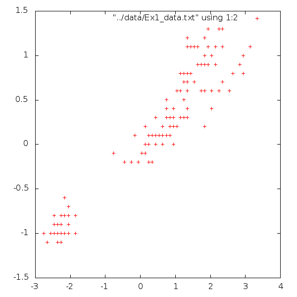
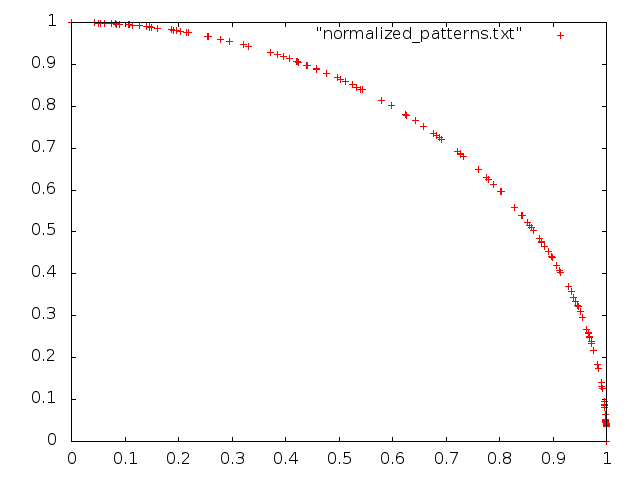
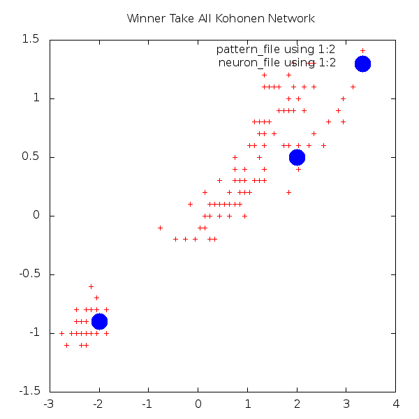
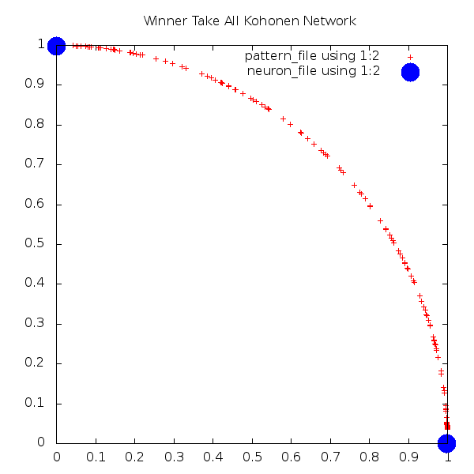
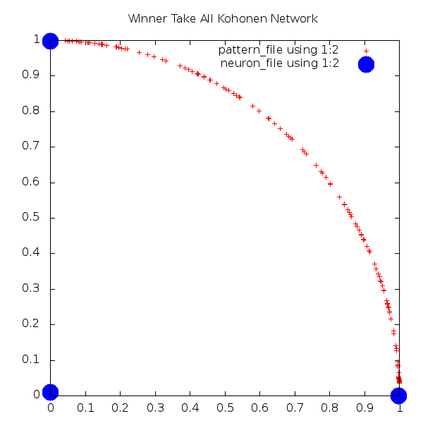
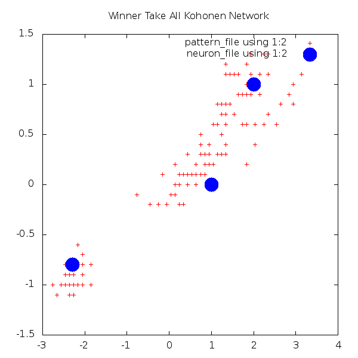
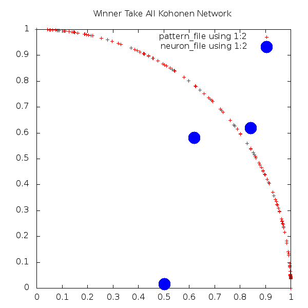
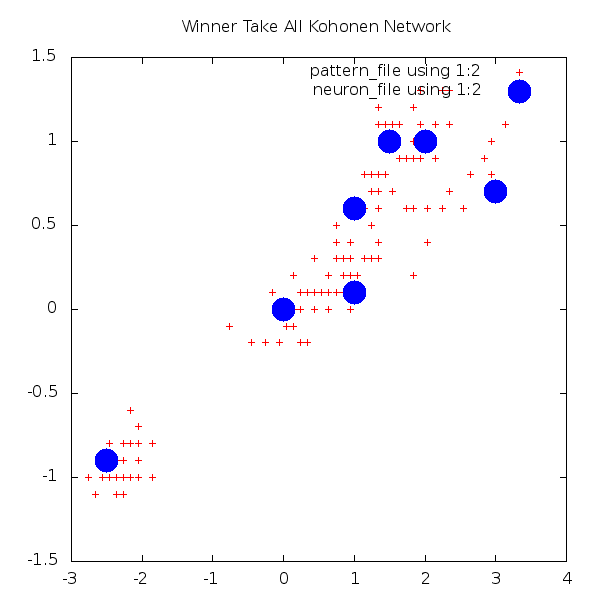
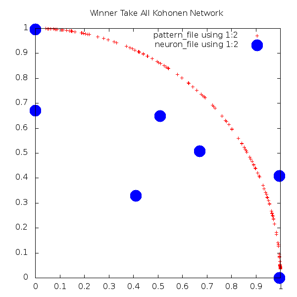
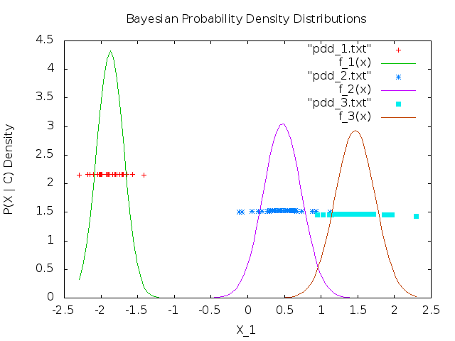

# CMSC 409 - Final Take Home Exam 

**I fully understand that I am on my honor to do my own work on this exam. If I violate this confidence, I amy receive a letter of "F" for this exam or for the course, or be expelled from the program.**

Keith Herbert, 13 December 2015

## 1. Kohonen Winner-Take-All Unsupervised Clustering
I had a difficult time getting started on this problem. My first fault was using the wrong lecture slides as a reference. I didn't understand how to use only 2 neuron's for a Kohonen network when the slides showed a whole grid of neurons. I also struggled with adapting my language of choice, R, to the problem. Fustrated, I decided to try learning MATLAB to attack the problem but felt overwhelmed and gave up to work on other projects I had due. After finishing a High Performance Computing project in Fortran, I realized that I could save my sanity by starting over again in Fortran. I also found that I was trying to implement the wrong kind of clustering network and started fresh with the slides from Session 11.  

----------------------------------------------------------------------------------------------

My solution to this problem is written in Fortan and uses Gnuplot for visualization. To run it, first go to the `kohonen` directory and compile the Fortran source code into an executable.

```
        $ cd kohonen
        $ gfortran kohonen.f90 -o kohonen.exe
```

To execute it, provide the filename containing the input patterns, the number of neurons, the number of features in each pattern, the learning rate alpha, and an integer to seed the random number generator. Here, we specify the Ex1 dataset with 2 neurons, 2 dimensions, alpha = 0.1 and the PRNG seeded to '12345'. (As a side note, the header line of Ex1_data.txt was removed to simplify reading).

```
    $ ./kohonen.exe ../data/Ex1_data.txt 2 2 0.1 12345 
```

The program prints the values for each pattern, their associated net values for each neuron, the number of the winning neuron, its new weighting after adjusting by the learning constant, and its normalized new weight. The final weights for each neuron are printed at the end. This can flood your terminal, so it might be best to append a `| less` to the command string. Plotting ready data files are written in the background for the normalized weights of the input patterns (default: `normalized_patterns.txt`) and for the normalized final neuron weights(`neurons.txt`). 

To plot, run gnuplot with the provided script `kohonen.plt`. This generates a .png file with the normalized patterns as tiny red crosses and the final neuron weights as big blue dots.

```
    $ gnuplot kohonen.plt
    Plotting to kohonen_7_neurons.png
```

### Raw data patterns



### Normalized data patterns



### Two-neuron network with random weights


### Two-neuron network with pre-set weights

    $ cat neuron_preset.txt 
    -2  -0.9
    2   0.5
    



    $ ./kohonen.exe ../data/Ex1_data.txt 2 2 0.1 9999 neuron_preset.txt 



### Three-neuron network with random weights





### Three-neuron network with pre-set weights
    $ cat neuron_preset.txt 
    -2.3, -0.8
    1, 0
    2, 1


    
    $ ./kohonen.exe ../data/Ex1_data.txt 3 2 0.1 9999 neuron_preset.txt 





### Seven-neuron network with random weights


### Seven-neuron network with pre-set weights





     Starting neuron weights (normalized)
      0.640184402      0.768221259    
      0.739165246      0.673524261    
      0.442022741      0.897003889    
      0.600440025      0.799669802    
      0.592845440      0.805316269    
      0.746444523      0.665447652    
      0.711592734      0.702592254 


     Final neuron weights
      0.995998919       2.47608496E-05
       2.07292924E-05  0.995845079    
       2.47608496E-05  0.671075344    
      0.995845079      0.409098148    
      0.671075344      0.508451283    
      0.409098148      0.329239368    
      0.508451283      0.649545372 



## 2. Bayesian Classification

I wrote the bayesian classifier in Perl and again used Gnuplot for visualization. This was relatively quick to write and test but I lost eight extra hours on it because I didn't know the difference between a probability distribution and a probability *density* distribution. The values above zero drove me completely insane -- I went in circles trying to normalize them out.

To use the classifier, first `cd` to the `bayes` directory. `bayes.pl` is the classification program. It takes a training csv file as the first arguement and a similar testing csv file as its second. When run, it generates a file for each class in the training data to use in plotting the density distributions and prints statistics about each density distribution. It then prints the results of comparing the testing data to the density distributions.   

    $ perl bayes.pl ../data/Ex2_train.txt ../data/Ex2_test.txt 

    Reading ../data/Ex2_train.txt to train Bayesian Classifier.
            Freq of 1: 35
            Mean of 1: -1.87261142857143
            Variance of 1: 0.0340754587265306
            Standard deviation of 1: 0.18459539194284
    Writing Gausian probability density distribution of class 1 to pdd_1.txt
            Freq of 2: 36
            Mean of 2: 0.472750888888889
            Variance of 2: 0.0684837490631543
            Standard deviation of 2: 0.261693998905505
    Writing Gausian probability density distribution of class 2 to pdd_2.txt
            Freq of 3: 41
            Mean of 3: 1.46419170731707
            Variance of 3: 0.0740618959214753
            Standard deviation of 3: 0.272143153361379
    Writing Gausian probability density distribution of class 3 to pdd_3.txt
    Generating gnuplot script bayesian_pdd.plt
    Reading ../data/Ex2_test.txt to evaluate classifier.
    -1.9022 2       0.403944958806461
    -1.9022 1       0.675355986550337
    -1.9022 3       0.352714986402171
    -1.9022 => 1
    -2.2961 2       0.376869764645682
    -2.2961 1       0.673305568121188
    -2.2961 3       0.317890513912323
    -2.2961 => 1
            ...
    Confusion matrix for Bayesian Classifier
                       1         2         3
             1        15
             2        14
             3         9

    $ gnuplot bayesian_pdd.plt

There is something wrong with the algorithm, or at least my implementation of it. Plotting the parameters to the probability density distribution functions shows category 1 to be confined to between [-2.5, 1] and the other two categories around [-0.5,1.5] and [0.5,2.5]. However, the bayesian probabilities always show the first category to the most likely on any input. What's really odd is that category 1 doesn't even have the highest probability on its own -- P(3) is the winner there. 



## 3. Zadeh Fuzzy Logic Controller
